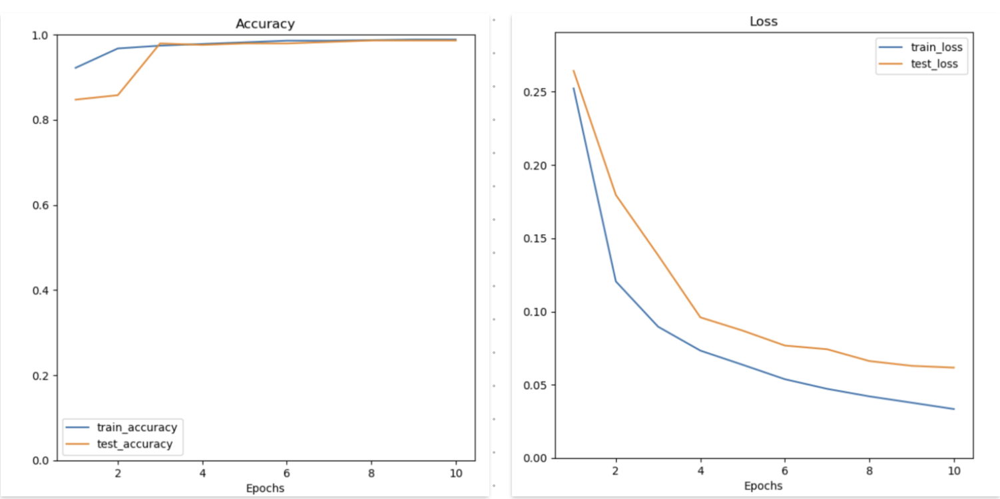
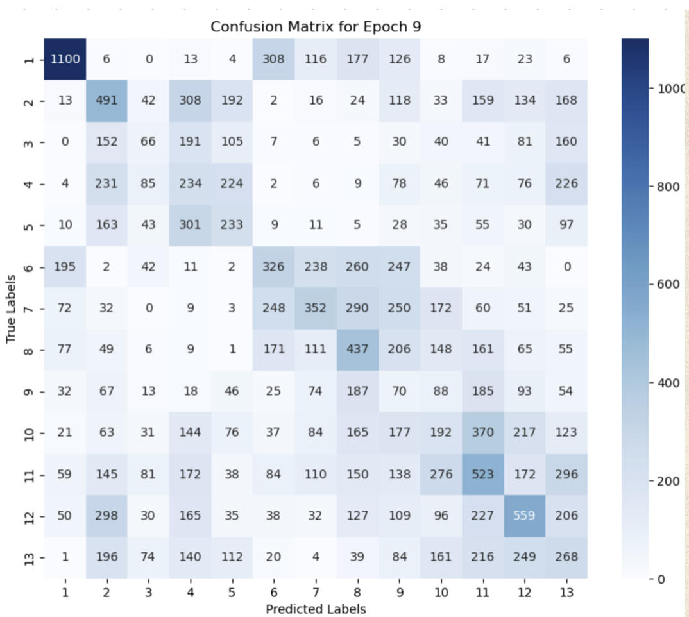

# Decoding Mixtec Codices using Vision Transformers
By Girish Vinayak Salunke on December 4, 2024

## What are the Mixtec Codices? 

Mixtec codices are ancient manuscripts created by the Mixtec people of pre-Hispanic Mesoamerica. Written in a semasiographic (image-based) system, they depict historical events, genealogies, and mythology on deerhide in an accordion-like format. These codices often detail the lives of rulers like Lord Eight Deer Jaguar Claw, whose conquests united the Mixtec region. Regarded as sacred, they legitimized leaders by linking them to divine origins. Six pre-Hispanic codices survive today, showcasing the Mixtec’s rich cultural legacy and unique visual storytelling.

For more information about the Mixtec and the mixtec codices checkout the blog: [A Look at the Mixtec Semasiographic Writing System](https://ufdatastudio.com/posts/2023-08-29-mixtec-blog/)

## Our Approach to Decoding the Codices

The Mixtec codices are remarkable for their semasiographic writing, a non-alphabetic system that relies on symbolic imagery to convey meaning. To decode them we must first understand the unique features of this writing system:

### Unique Features of the Mixtec Codices

1. **Non-linear Reading Pattern**  
    The codices are read in a zigzag or serpentine sequence, guided by red or yellow lines connecting images. A reader needs to follow the right to left direction. The arrow in blue depicts the reading pattern for the page in the image above.

2. **Symbols for Years and Days**  
    A calendar system combines a 260-day ritual calendar with a 365-day solar calendar. Years are marked with symbols like Flint, Reed, House, and Rabbit, alongside numbers for specific dates. In the image above the circles in red depict the year and date symbols.
    
3. **Name Symbols**
    Individuals are represented by pictorial symbols, often combining an animal, plant, or object with a numerical prefix (e.g., “8 Deer” for Lord Eight Deer Jaguar Claw). These symbols often indicate personal or ancestral significance. In the image above the circles in green depict year symbols depict the name symbols.

One of the most important aspects of decoding the events described in these codices, is identifying the dates and the characters depicted in the scenes. 

>Therefore in this project we first focus on training Vision Transformer models to do this job.

## Understanding the Mixtec Year and Name Symbols

Identifying the year and name symbols requires us to first understand the calendar system used my the Mixtecs.

The Mixtec and Aztec civilizations used a sophisticated calendar system that intertwined a sacred calendar and a solar calendar. 

1. **The Sacred Calendar (Tonalpohualli):**  
   This calendar consisted of 260 days, divided into 20 day signs paired with 13 numbers. Each combination of a day sign and a number created unique days, forming a cycle of 260 days. It was primarily used for religious purposes, divination, and determining auspicious dates for events like ceremonies or personal milestones.

2. **The Solar Calendar (Xiuhpohualli):**  
   This 365-day calendar included 18 months of 20 days each, plus 5 "extra" days called Nemontemi, considered an unlucky period. This calendar tracked agricultural and seasonal cycles and was integral to planning farming activities and festivals.

3. **The Calendar Round:**  
   The sacred and solar calendars worked together to form a 52-year cycle, known as the "Calendar Round." Each day within this period had a unique combination of a sacred and solar date, providing a precise way to record and commemorate historical events.

4. **Day Symbols:**  
   The Mixtec adopted Aztec day signs for their sacred calendar, as reflected in manuscripts and sculptures like the famous Aztec Sun Stone. This shared system unified aspects of cultural and spiritual life across civilizations. 
   
The figure below depicts the day symbols: 

### Year Symbol

Years are identified using symbols combined with numbers to form a unique designation for each year. This method belongs to the 365-day solar calendar system and involves a repeating cycle of four symbols: **House**, **Rabbit**, **Reed**, and **Flint**. Each of these symbols corresponded to a cardinal direction.

#### How It Works:
1. **Year Cycles and Numbers**:  
   Each year is paired with a number (1 to 13) and one of the four symbols. For example, a year might be called "1 Rabbit" or "3 Reed." This numbering and naming system cycled through 52 years before repeating, aligning with the "Calendar Round."

2. **Cultural Significance**:  
   - These symbols were not arbitrary but carried cosmological and ritual significance. For instance, "Rabbit" might be associated with fertility and abundance, while "Flint" could signify war or sharpness.
   - Each symbol and number combination was believed to influence the character or fate of that year.

>The figure below shows a few examples:

### Name Symbol
In Mixtec culture, names were a unique combination of numerical prefixes and symbolic imagery that reflected personal identity and often held deep cultural or mythological significance.

#### Features of the Mixtec Naming System:
The symbol for the name consists of two parts:
1. **Day Numbers (1 to 13)**  
    The calendar was organized into 20 cycles, each lasting 13 days (trecenas). Days within each cycle were sequentially numbered from 1 to 13.
2. **Day Signs (20 Unique Symbols)**  
     Each day also carried one of 20 distinctive signs: Crocodile, Wind, House, Lizard, Serpent, Death, Deer, Rabbit, Water, Dog, Monkey, Grass, Reed, Jaguar, Eagle, Vulture, Earthquake, Flint, Rain, and Flower​

#### Training the Classifiers

In order to identify the names and years correctly. We trains 3 classifiers. 

1. **Name-date/Year Classifer**  
    This classifier will determine whether the image provided is a name symbol or a year symbol.

2. **Symbol Classifier**  
    This classifier will identify the symbol depicted in the image.

3. **Year Counter**
    This classifier will count the number of beads in the image to identify the day number depicted in the images.

>The input image will be subjected to the following workflow:

## Using Vision Transformers for Classification

The classification task involved images with intricate patterns and subtle differences between classes, where it was essential to understand both global and local contexts simultaneously and vision transformers are 
the best choice for this task. **Vision Transformer (ViT)** is a model based on the transformer architecture, originally designed for natural language processing (NLP) tasks but adapted for vision tasks.To learn more about the performance of vision transformers in scenarios like these refer to the paper: [Analyzing Finetuned Vision Models for Mixtec Codex Interpretation](https://aclanthology.org/2024.americasnlp-1.6.pdf)

### Dataset

The dataset used for training the vision Transformers can be found on [huggingface.com](https://huggingface.co/datasets/ufdatastudio/mixtec-zouche-nuttall-british-museum). The dataset consists of:

Extracted labelled data from 3 Codices:

1. **Vindobonensis Mexicanus (65 pages):** Describes both the mythological and historical founding of the first Mixtec kingdoms.

2. **Selden (20 pages)**: follows the founding of the kingdom of Jaltepec and its ruler, Lady 6 Monkey.

3. **Zouche-Nuttall (facsimile edition (40 pages))**: illustrates the life and conquests of Lord 8 Deer Jaguar Claw, but also details the histories of his ancestors.

### Training the Vision Transformers
We used the transfer learning process to train our classifers as we do not have a large number of images for training.

Using transfer learning to train a Vision Transformer (ViT-B-16) model for image classification involves leveraging a pre-trained model and fine-tuning it on our dataset. The idea is to use the knowledge learned by the pre-trained model and apply it to solve the new task, often with fewer training examples, reducing the need for extensive computational resources and time. Here's a step-by-step explanation of the process and the underlying concepts:

#### 1. **Selecting the Pre-trained Vision Transformer (ViT) Model**
   - We selected the pre-trained ViT-B-16 model with the base architecture (ViT-B) and a patch size of 16 pixels (16x16), which divides input images into smaller patches to be processed in parallel.
   - The model is typically pre-trained on a large dataset like **ImageNet**, which allows it to learn general visual features useful for a wide range of tasks.

#### 2. **Preparing The Dataset**
   - To fine-tune the model, we needed to split the images into multiple folder where the folder name corresponded to the class to which the image belonged.
   - The dataset was then split into training and test sets and then image augmentation techniques were applied to it to increase diversity and improve generalization. We used **random rotations**, **masking** and **color jitter** techniques.

#### 4. **Loading the Pre-trained ViT Model**
   - We loaded the ViT-B-16 model with pre-trained weights from PyTorch. The model’s initial layers have already learned to recognize basic features like edges, textures, and shapes from the large dataset.
   - The pre-trained model typically has a final classification head suited for the original task, we replaced the head to match the number of categories in our dataset.

#### 5. **Modifying the Model for Fine-tuning**
   - We freezed all the layers (except the last layer(classification head)) to prevent them from being updated during training. Freezing the early layers (which capture basic features) and only training the later layers (which capture more task-specific features) significantly improves training speed and stability.

#### 6. **Model Optimization**
   - After training, we further optimized the model by adjusting hyperparameters like learning rates, batch size, or optimizer choices.

### Results
We used transfer learning for training all the three classifier mentioned above and achieved the following results:

1. **Name-date/ Year Classifier**

    >We achieved a test accuracy of 98% for the name-date/year classifier. 

    
    
    This accuracy is really great for our project. It also demonstrates how good vision transformers are for image classification tasks.

2. **Symbol Classifier**

    >We achieved a test accuracy of 86% for the symbol classifier. 

    

    

3. **Year Classifier**

    > We achieved a test accuracy of 25% for the name-date/year classifier. 

    
    
    
    Using vision transformers for counting the number of beads was more of an experiment. The terrible accuracy was expected because Vision Transformers (ViTs) are less suited for counting objects in an image because they prioritize capturing global patterns and contextual relationships rather than precise localization or repetitive structures. Their patch-based processing often overlooks the detailed spatial information necessary for accurately counting multiple instances of an object.

    A better approach for this classifier is using object detection techniques. Checkout this [blog](https://github.com/Aishwarya-Tonpe/Independent-study/blob/main/Blog.md) to learn more about the results of that approach.

## Conclusion

The Mixtec Research Project is more than just a technological experiment—it’s a journey into history, art, and culture, powered by modern machine learning. By training Vision Transformers to recognize intricate symbols like Mixtec names and years, we’ve taken meaningful steps toward decoding the stories etched into these ancient manuscripts. While challenges like bead counting remind us that no single tool fits every task, they also push us to explore creative solutions, blending modern AI with classical techniques.

At its heart, this project is about connecting with the past. Each decoded symbol, name, or date is a small piece of the Mixtec legacy brought back to life. As we refine our methods and expand our understanding, the vision remains clear: to use technology not just to translate ancient texts but to celebrate and preserve the cultural brilliance of a civilization whose voice still resonates through its art.